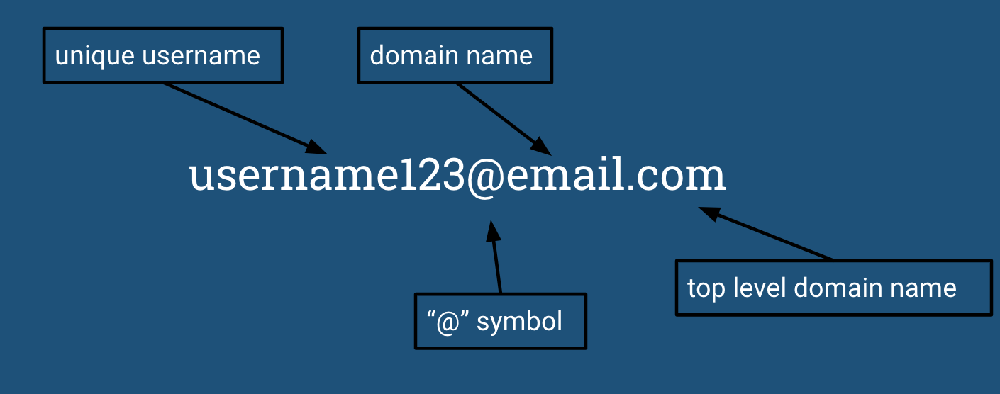

# Regular Expression Tutorial for Matching an Email
# ```/^([a-z0-9_\.-]+)@([\da-z\.-]+)\.([a-z\.]{2,6})$/```

A regular expression (regex) is a sequence of characters that match a pattern. They are used in various environments, including programming, databases, and search apps. 


## Summary

An email is something that almost everyone has and each one is unique to match that person's needs. Most people choose a username that includes their first and last name, making it easy to reach them. Popular domains include gmail, yahoo, and outlook, and these domains have ".com" as their top level domain name (TLD). Most businesses have a unique domain name; they are similar to a street address in terms of delivery. Universities have their own domain name with ".edu" as their TLD. 
<br>
In this tutorial, I will break down the basic components of an email regex.


## Table of Contents

- [Anchors](#anchors)
- [Quantifiers](#quantifiers)
- [OR Operator](#or-operator)
- [Character Classes](#character-classes)
- [Flags](#flags)
- [Grouping and Capturing](#grouping-and-capturing)
- [Bracket Expressions](#bracket-expressions)


## Regex Components

### Anchors
The email regex uses anchors: ```^```. The ```^``` denotes the start of the string and ```$``` denotes the end of the string.

### Quantifiers
The following quantifiers are used in this regex: ```+``` ```{x, y}``` 
<br>
```+``` means "one or more". ```{x, y}``` is used to represent the min and max of characters: ```x``` representing the min and ```y``` representing the max. 
<br>
As an example, the first ```+``` in the email regex means one or more characters will satifify the requirements of ```[a-z0-9_\.-]``` and the second ```+``` denotes one or more characters in ```[\da-z\.-]```. The ```{2,6}``` towards the end of the regex indicate the requirements of 2-6 characters in the group ```[a-z\.]```.

### OR Operator
The only OR operator used is ```[]```
<br>
For example, ```[a-z0-9_\.-]``` means that any character ```a-z```, digit ```0-9```, ```_ . -``` may be used.  ```\``` denotes a literal ```.``` instead of the meaning "any character".

### Character Classes
The character class used is ```\d``` which denotes any digit character. The ```\``` indiactes the character class, which is distinct from a plain ```d```.

### Flags
This regex is enclosed with two ```/``` characters with no flags. Since multi-line is disabled, the anchors march a string instead of a start and end of a line.

### Grouping and Capturing
Parentheses ```()``` are used to capture a group. There are three sets, capturing the username, domain name, and the TLD. 
<br>

<br>


## Author
My name is Marie DeVoll and I am a full stack web developer in training! My github is [mariedevoll](https://github.com/mariedevoll). My email is always open marie.devoll@gmail.com

